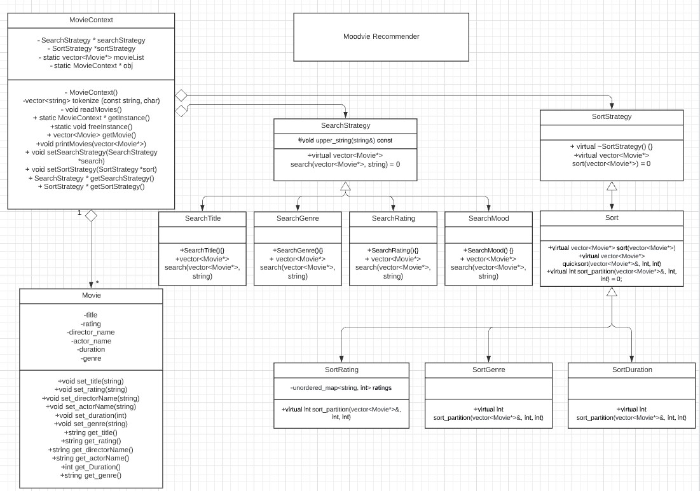

# Moodvie

 
 > Authors: \<[Gary Zeng](https://github.com/Garrrrrrrrry)\>
 > \<[Selena Arias](https://github.com/sarias-012)\>
 > \<[Kristian Jordan](https://github.com/kristianjordan)\>
 

 

## Project Description
 > The movie recommender idea is interesting to us because we all enjoy watching tv shows and movies via netflix and other streaming platforms; we want to learn more about how other shows and movies get recommended to us as users. It’s important because no matter where people go online, items/products are constantly being recommended to them based upon their personal data and interests. We believe that being able to understand the process of how things are recommend is critical to our growth and can prepare us for future jobs. In addition, creating a movie recommender would give us experience for incorporating several search and sorting algorithm. We thought it would be interesting to have a movie app that recommends a certain of genre depending on your mood. The features that the project will provide are genre, rating and mood. User's mood determines the input of whether the person is feeling sad, happy or neutral. Based on their mood, the User's mood feature will automatically generate movies for them. Genre is a feature where one is able to manually select a certain type of genre if they happen to op-out in the User's mood feature. 
 > 
 > Languages: c++
 > 
 > Frameworks: GoogleTest
 > 
 > Tools: putty, vim, valgrind
 > 
 > (I/O for program will be through terminal)
 > 
 > Input: User's mood (happy, sad, or neutral), genre (e.g. fantasy, romance, etc), and Motion Picture Association film rating system (accepts rating of G, PG, PG-13, R, NC-17, etc).
 > 
 > Output: List of movies that matches the description given based on the User’s given mood, genre, and rating.

## Class Diagram
 > The MovieContext class is a context class that implements a singleton design pattern. Its job is to instantiate the MovieContext object, populate movie data into a vector, return the vector, and set and get the strategies. In addition, it contains a class called Movie, which holds the movies attributes (i.e title, rating, duration) and setter and getter functions. It also contains the SearchStrategy and SortStrategy abstract classes, which both implement a strategy design pattern (holds the concrete algorithms for search and sort).SearchStrategy and SortStrategy set the interface for its subclasses that require the implementation of a virtual search and sort function. SearchStrategy concrete classes are SearchTitle, SearchGenre, SearchRating, and SearchMood. SortStrategy concrete classes are SortGenre, SortRating, and SortDuration. We chose to implement MovieContext using the singleton design, due to its ability to instantiate the class once. Doing so helps us write better code, as it allows the repository of movies not to be recreated and manipulated. As for the SearchStrategy and SortStrategy classes, using a strategy design made the most sense. We have four different ways of searching and three different ways of sorting, with only the strategy of how we search and sort that changes.

 > 
 >  
 >

 
 > ## Final deliverable
 > All group members will give a demo to the TA during lab time. The TA will check the demo and the project GitHub repository and ask a few questions to all the team members. 
 > Before the demo, you should do the following:
 > * Complete the sections below (i.e. Screenshots, Installation/Usage, Testing)
 > * Plan one more sprint (that you will not necessarily complete before the end of the quarter). Your In-progress and In-testing columns should be empty (you are not doing more work currently) but your TODO column should have a full sprint plan in it as you have done before. This should include any known bugs (there should be some) or new features you would like to add. These should appear as issues/cards on your Project board.
 > * Make sure your README file and Project board are up-to-date reflecting the current status of your project (e.g. any changes that you have made during the project such as changes to your class diagram). Previous versions should still be visible through your commit history. 
 
 ## Screenshots
 > 
 > Input/Output of searching the title of the movie while sorting by genre.
 > 
 > 
 > Input of search by horror genre and sort by rating.
 > 
 > 
 > Output results of search by horror genre and sort by rating.
 > 
 > 
 > Input/Ouput of search by rating G and sort by duration.
 > 
 > 
 > Input of search by neutral mood and sort by genre.
 > 
 > 
 > Output of search by neutral mood and sort by genre.
 > 
 > 

 ## Installation/Usage
 > Instructions on installing and running your application
 ## Testing
 > 
 > With the use of Valgrind, we incorporated the Memcheck tool to find errors and issues with memory leaks. We made sure to use the "valgrind --leak-check=full" for both test executable and moodvie executable. Tests were created for the search strategy, sort strategy, and for the singleton design.
 > 
 > 
 > Testing the test executable for memory leaks.
 > 
 > 
 > 
 > 
 > Testing the moodvie executable for memory leaks.
 > 
 > 

 > 
 
 
